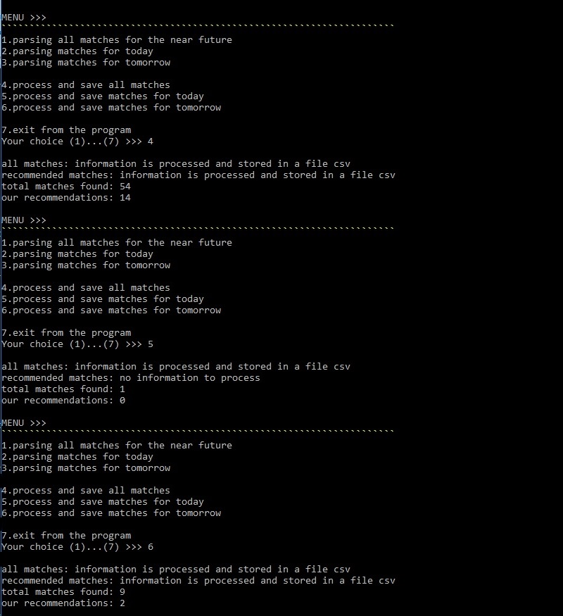

# match parsing & recommendation system
### parsing matches from the virtualbet 24 website 
### search and based on the collected information, recommendations for games

<kbd></kbd>

## system manual :soccer:
### step by step

***1. get web pages in different versions:***
- all existing matches
- matches for today
- matches for tomorrow

<kbd></kbd>

***2. obtaining the necessary information using scraping, saving with pandas, 
creating recommendations based on a computer algorithm, for:***
- all matches
- matches for today
- matches for tomorrow

<kbd></kbd>

***3. get output files in csv format, if certain criteria are met, recommendations:***

<kbd></kbd>

<kbd></kbd>

***
